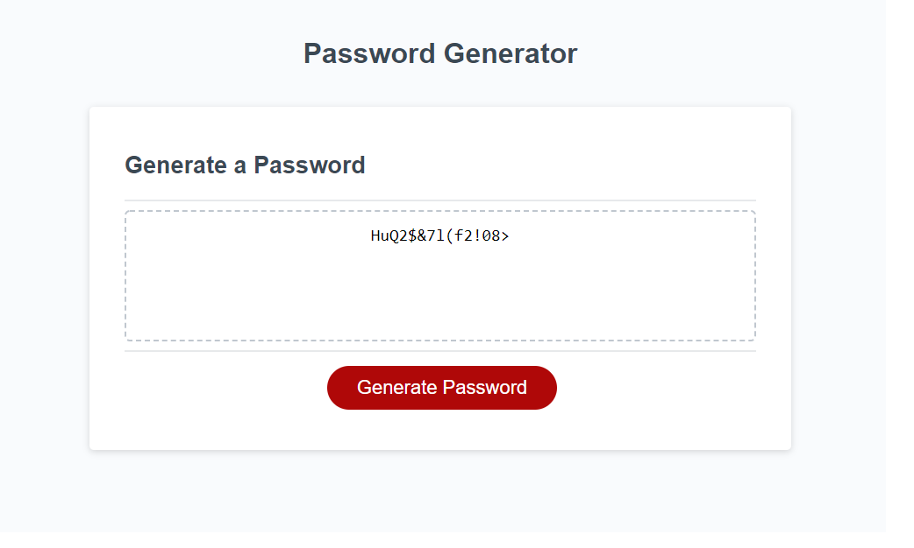
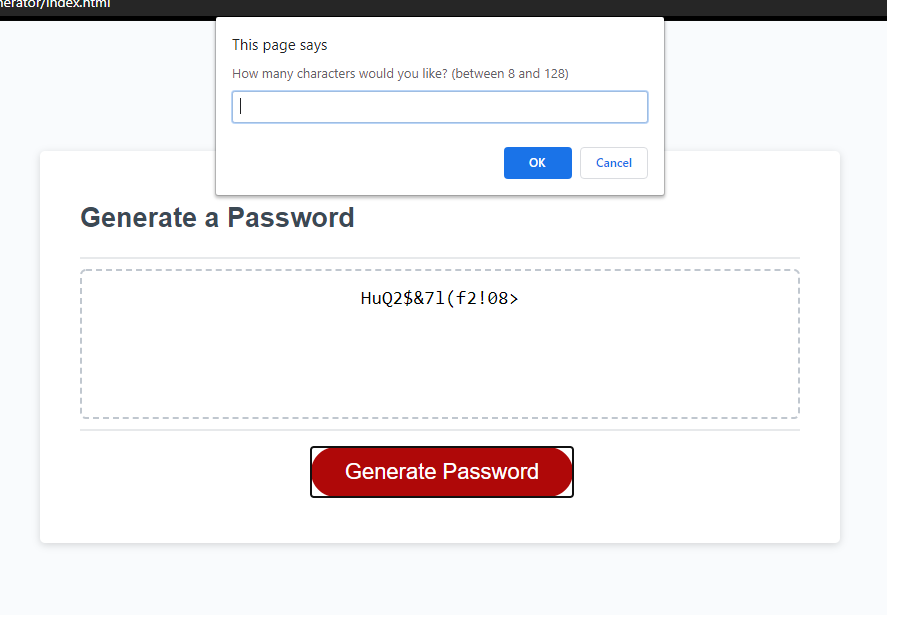

# Password-Generator

## Description
For this project, the goal was to create a web application utilizing JavaScript to create random passwords within user selected criteria. I began by creating a function that begins with the user clicking the button. Within this function, the first step was to create prompts for the user asking them to select the number of characters and what kind of characters they wish to be generated. If they select a number outside the range of 8 and 128, type letters, do not select any criteria, or do not type anything, they are met with an alert telling them what they did wrong. When all criteria are entered, the length they enter and character type they select are stored and used to control which characters go into the array of possible characters. I then created another function to select random characters out of that array and insert them into a new array within which the password is held. This function is called after all criteria are selected, and followed by if statements to ensure at least one of each character type is included in the final password. The password is then displayed in the text area of the card. When attempting to generate a new password, the function resets both arrays used to generate the password, allowing for another password to be generated. 

## Table of Contents

* [Installation](#installation)
* [Usage](#usage)
* [Built With](#built)
* [Deployed Link](#deployed)
* [Author](#author)
* [Images](#images)
* [License](#license)

## Installation
To launch this site, I created a repository on github and utilized github pages to host it.

## Usage
When a user clicks the generate button, they are met with a series of prompts for password criteria. If the user types a number less than 8, more than 128, anything that is not a letter, or nothing at all they are returned to start with an alert. They must also select at least one of these criteria or be returned to start with an alert. The applet then generates a password within the given criteria and including at least one of each selected character type.

## Built With
* HTML
* CSS
* JavaScript
* [Github](https://github.com/)

## Deployed Link
[Jon SanPedro Portfolio Website](https://jsp117.github.io/Password-Generator/)

## Author
Jonathan SanPedro - Bachelors of Information Technology Rutgers New Brunswick - Student at Berkeley Coding Bootcamp

* [Github](https://github.com/jsp117)
* [LinkedIn](https://www.linkedin.com/in/jonathan-s-6ab32283/)

## Images

## License

MIT License

Copyright (c) [2020] [Jonathan J. SanPedro]

Permission is hereby granted, free of charge, to any person obtaining a copy
of this software and associated documentation files (the "Software"), to deal
in the Software without restriction, including without limitation the rights
to use, copy, modify, merge, publish, distribute, sublicense, and/or sell
copies of the Software, and to permit persons to whom the Software is
furnished to do so, subject to the following conditions:

The above copyright notice and this permission notice shall be included in all
copies or substantial portions of the Software.

THE SOFTWARE IS PROVIDED "AS IS", WITHOUT WARRANTY OF ANY KIND, EXPRESS OR
IMPLIED, INCLUDING BUT NOT LIMITED TO THE WARRANTIES OF MERCHANTABILITY,
FITNESS FOR A PARTICULAR PURPOSE AND NONINFRINGEMENT. IN NO EVENT SHALL THE
AUTHORS OR COPYRIGHT HOLDERS BE LIABLE FOR ANY CLAIM, DAMAGES OR OTHER
LIABILITY, WHETHER IN AN ACTION OF CONTRACT, TORT OR OTHERWISE, ARISING FROM,
OUT OF OR IN CONNECTION WITH THE SOFTWARE OR THE USE OR OTHER DEALINGS IN THE
SOFTWARE.

